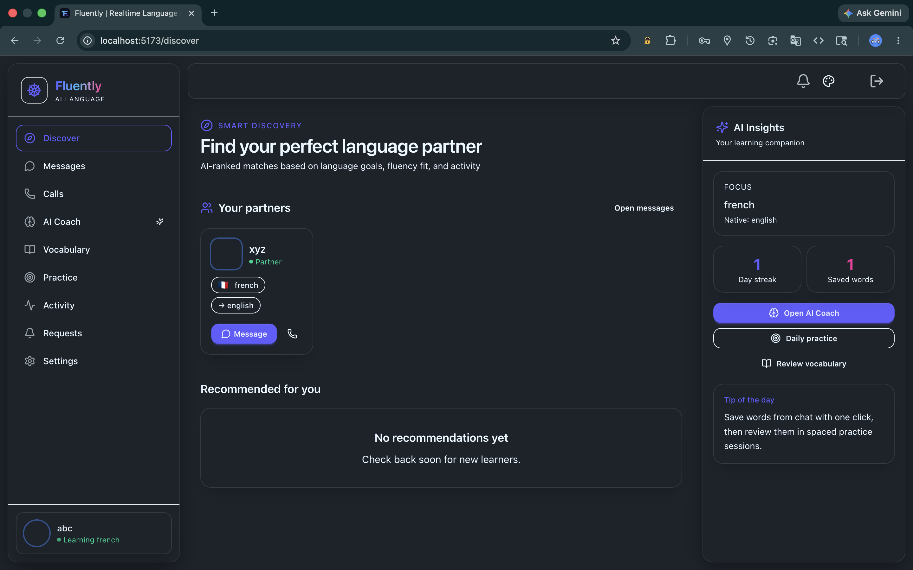
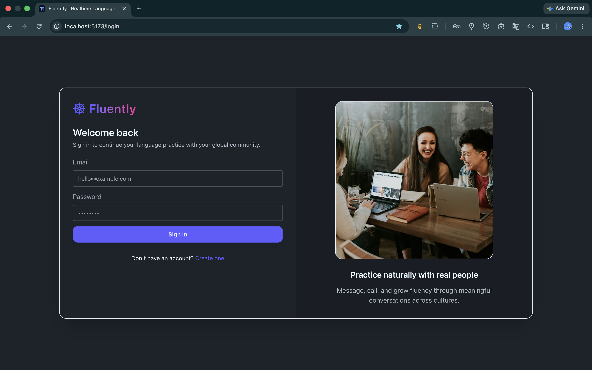
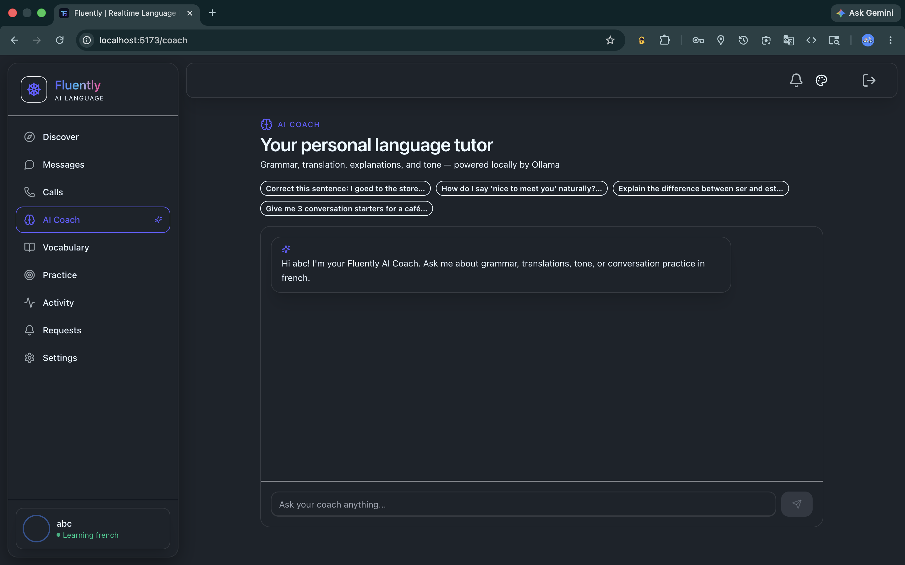
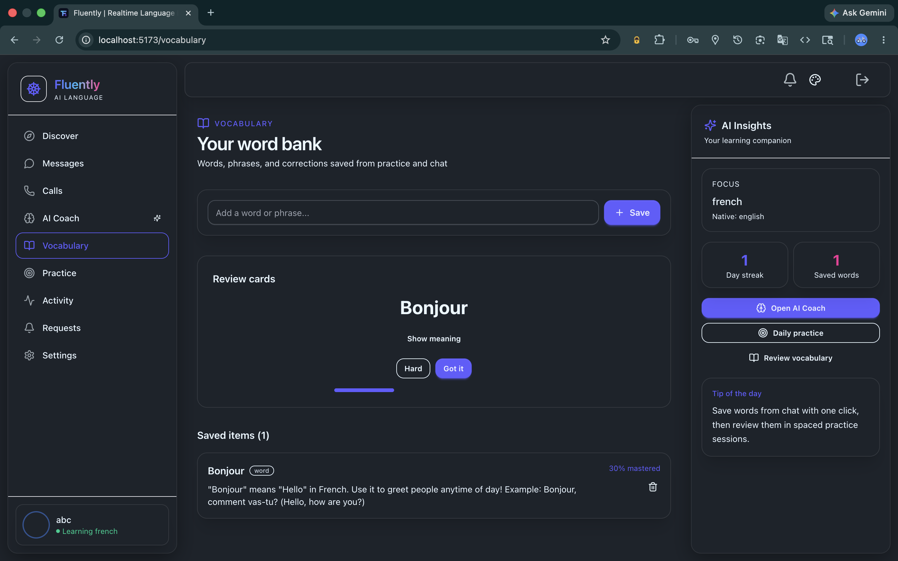
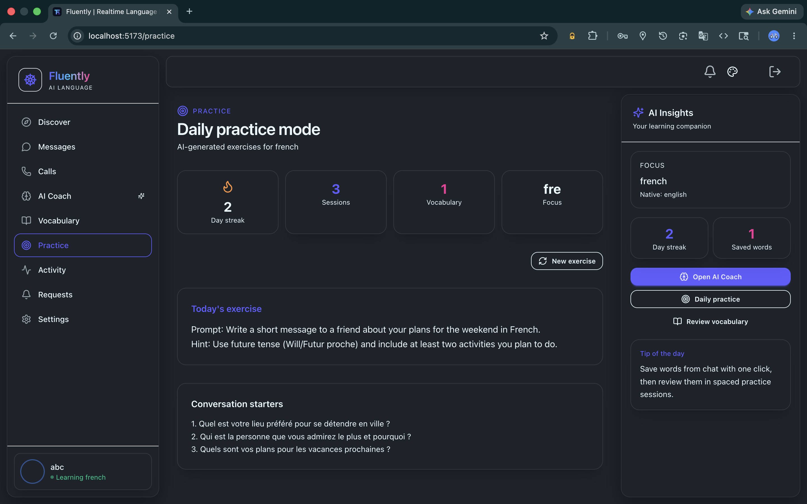

<div align="center">

# 🌍 Fluently

### AI-Native Language Learning Platform

Practice languages naturally through real-time messaging, video calls, and AI-powered learning experiences.

<br>


</div>

---

<p align="center">
  
</p>

---

## Overview

Fluently is a full-stack language learning platform designed to connect learners through meaningful conversations instead of traditional passive learning methods.

The platform enables users to discover language partners, build connections, exchange messages in real time, join video calls, and leverage AI-powered learning tools to improve fluency through practical communication.

By combining social interaction, real-time communication, and AI-assisted learning experiences, Fluently creates an immersive environment for language acquisition.

---

## Features

### Authentication & User Management

* Secure JWT Authentication
* HTTP-only Cookie Sessions
* Protected Routes
* User Onboarding Workflow
* Personalized Profiles

### Social Learning Network

* Discover Language Partners
* Friend Request System
* User Connections
* Learning Community Experience

### Real-Time Messaging

* Instant Messaging
* Persistent Conversations
* Stream Chat Integration
* Responsive Chat Interface

### Video Calling

* One-to-One Video Calls
* Real-Time Communication
* Stream Video SDK Integration

### AI-Powered Learning

* AI Coach Interface
* Vocabulary Builder
* Interactive Practice Sessions
* Local LLM Integration using Ollama

### Modern User Experience

* Glassmorphism UI
* Responsive Design
* Modern Dashboard Layout
* Smooth Navigation Experience

---

## Tech Stack

### Frontend

* React
* Vite
* Tailwind CSS
* DaisyUI
* Zustand
* TanStack Query
* Axios

### Backend

* Node.js
* Express.js
* JWT Authentication
* Cookie-Based Session Management

### Database

* MongoDB
* Mongoose

### Real-Time Infrastructure

* Stream Chat SDK
* Stream Video SDK

### AI Layer

* Ollama

---

## Screenshots

### Login Page



### Home Page


### AI Coach



### Vocabulary Builder



### Practice Sessions



---

## Project Structure

```text
fluently/
│
├── backend/
│   └── src/
│       ├── controllers/
│       ├── middleware/
│       ├── models/
│       ├── routes/
│       └── lib/
│
├── frontend/
│   └── src/
│       ├── components/
│       ├── hooks/
│       ├── pages/
│       ├── store/
│       └── lib/
│
├── screenshots/
├── docs/
├── README.md
└── LICENSE
```

---

## Local Setup

### Clone Repository

```bash
git clone https://github.com/adars-h-agrawal/fluently.git
cd fluently
```

### Install Dependencies

```bash
cd backend
npm install

cd ../frontend
npm install
```

### Environment Variables

Backend (`backend/.env`)

```env
PORT=5001
MONGO_URI=your_mongodb_connection_string
JWT_SECRET=your_jwt_secret
STREAM_API_KEY=your_stream_api_key
STREAM_API_SECRET=your_stream_api_secret
CLIENT_URL=http://localhost:5173
```

Frontend (`frontend/.env`)

```env
VITE_STREAM_API_KEY=your_stream_api_key
VITE_API_BASE_URL=http://localhost:5001/api
```

### Run Backend

```bash
cd backend
npm run dev
```

### Run Frontend

```bash
cd frontend
npm run dev
```

---

## Core Functionalities

* User Registration & Login
* Secure Authentication
* User Onboarding
* Friend Request System
* Real-Time Messaging
* Video Calling
* AI Learning Features
* Vocabulary Assistance
* Interactive Practice Sessions
* Session Persistence
* Protected Routes

---

## Future Improvements

* Pronunciation Analysis
* Speech-to-Text Practice
* AI Lesson Generation
* Learning Progress Analytics
* Gamification System
* Group Learning Rooms
* Mobile Application

---

## License

This project is licensed under the MIT License.

See the LICENSE file for details.

---

## Acknowledgements

* Stream Chat
* Stream Video
* MongoDB
* React
* Express
* Tailwind CSS
* Ollama

---

⭐ If you found this project interesting, consider giving it a star.
